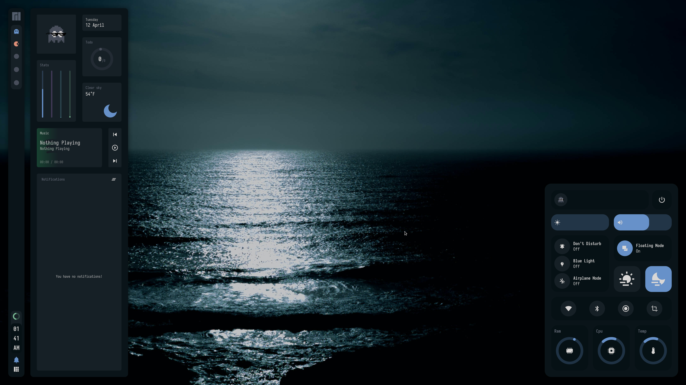

<!-- Screenshot -->
<div align="center">
    
</div>

<h2></h2><br>

<p align="center">
  <b> Sweet B & A for Awesome WM </b>
</p>


<h2></h2><br>

<div align="center">
    
    
</div>

<br>
<br>

### Welcome
<a href="https://awesomewm.org/"></a>

<b> What is the purpose of Sweet B & A? </b>

This is primarily a fork of Rxyhn's repository for the purpose of making the rc.lua file
more streamlined. Relocating what were magic numbers and putting them into a centralized
variable. This also adds some creature comforts like being able to switch the time
across the entire theme from standard to imperial, or adding a desktop wallpaper.

I will have some goals for the end of this project, those will be listed further down.
Everything here is very much a work in progress, and hasn't been tested extensively.
It would seem that some things that work for Arch do not work for Manjaro, so I would
not be surprised if the inverse is also true.

I'll also attempt to manually pull from upstream, but if it ends up breaking things
too often, I may just decide to fully deviate the fork.

<h2></h2><br>

**Here are some details about my setup:**

| Programs   | Using             |
| ---------- | ----------------- |
| WM         | awesome           |
| OS         | Manjaro           |
| Terminal   | alacritty / xfce4 |
| Shell      | zsh               |
| Editor     | neovim / notepadqq|
| Compositor | picom             |
| Launcher   | rofi              |

<h2></h2><br>

<table align="right">
  <tr>
    <th align="center">
      <sup><sub>⚠ WARNING ⚠</sub></sup>
    </th>
  </tr>
  <tr>
    <td align="center">
      <sup><sub><samp>THESE DOTFILES ARE CONFIGURED FOR 3840x2160 WITH 172 DPI.</samp></sub></sup>
    </td>
  </tr>
</table>

<details>
<summary><strong>S E T U P</strong></summary>

   > This is step-by-step how to install these dotfiles. Just [R.T.F.M](https://en.wikipedia.org/wiki/RTFM).

   > This setup only provided for **Arch Linux** (and all Arch-based distributions)

   1. Install the [git version of AwesomeWM](https://github.com/awesomeWM/awesome/).

      ```sh
      paru -S awesome-git
      ```

   2. Install dependencies and enable services

      + Dependencies

         ```sh
         paru -Sy picom-git alacritty rofi todo-bin acpi acpid acpi_call \
         wireless_tools jq inotify-tools polkit-gnome xdotool xclip maim \
         brightnessctl alsa-utils alsa-tools pulseaudio lm_sensors gpick \
         mpd mpc mpdris2 ncmpcpp playerctl redshift ffmpeg bluez-utils --needed
         ```

      + Services

         ```sh
         # For automatically launching mpd on login
         systemctl --user enable mpd.service
         systemctl --user start mpd.service

         # For charger plug/unplug events (if you have a battery)
         sudo systemctl enable acpid.service
         sudo systemctl start acpid.service
         ```

   3. Install needed fonts

      You will need to install a few fonts (mainly icon fonts) in order for text and icons to be rendered properly.

      Necessary fonts:
      + **Iosevka**  - [here](https://github.com/ryanoasis/nerd-fonts/)
      + **Icomoon**  - [here](https://www.dropbox.com/s/hrkub2yo9iapljz/icomoon.zip?dl=0)
      + **Material Design** - [here](https://github.com/Templarian/MaterialDesign-Font)

      Once you download them and unpack them, place them into `~/.fonts` or `~/.local/share/fonts`
      and run this command for your system to detect the newly installed fonts.

      ```sh
      fc-cache -v
      ```

   4. Install my AwesomeWM configuration files

      > Clone this repository

      ```sh
      git clone https://github.com/MasterMathew/Sweet-B-and-A.git
      cd Sweet-B-and-A
      ```

      > Copy config and binaries files

      ```sh
      cp -r config/* ~/.config/
      cp -r bin/* ~/.local/bin/
      cp -r misc/. ~/
      ```

      > You have to add `TODO_PATH` in your env variable

      ```sh
      export TODO_PATH="path/to/todo"
      ```

   5. Configure stuff

      The relevant files are inside your `~/.config/awesome` directory.

      + User preferences and default applications

         In `rc.lua` there is a *Default Applications* section where user preferences and default applications are defined.
         You should change those to your liking.

         Note: For the weather widgets to work, you will also need to create an account on [openweathermap](https://openweathermap.org), get your key, look for your city ID, and set `openweathermap_key` and `openweathermap_city_id` accordingly.

   6. Lastly, log out from your current desktop session and log in into AwesomeWM.

</details>

<br>

<details>
<summary><strong>F E A T U R E S</strong></summary>

<b>These are the features included in Sweet-B-and-A for AwesomeWM!</b>


   + Have two themes!
      - <details>
         <summary>Beautiful Day</summary>

         *created by [rxyhn](https://github.com/rxyhn), comfortable light colorscheme!*

         <div align="left">
         
         </div>
         </details>
      - <details>
         <summary>Aesthetic Night</summary>

         *created by [ner0z](https://github.com/ner0z), extremely aesthetic dark colorscheme!*

         <div align="left">
         
         </div>
         </details>
   + Aesthetic `Dashboard` ngl.
      - <details>
         <summary>Preview</summary>

         *Aesthetic dashboard with neat grid layout, it's so clean!*

         <div align="left">
         
         </div>
         </details>
   + Very useful `Control Center` ikr.
      - <details>

          *This control center has many features!*

         - Exit screen
         - Volume & brightness control
         - DnD, Blue light & Airplane mode
         - Floating layout mode
         - `Theme switcher`
         - wifi & bluetooth toggle
         - built in `screenrec` and `screensht` widgets
         - Hardware Monitor

         <summary>Preview</summary>
         <div align="left">
         
         </div>
         </details>
   + Custom mouse-friendly `ncmpcpp` UI with album art ofc.
      - <details>
         <summary>Preview</summary>

         *This is aesthetic*

         <div align="left">
         
         </div>
         </details>
   + `Word Clock Lockscreen` with PAM Integration!
      - <details>

         *A lockscreen word clock*

         <summary>Preview</summary>
         <div align="left">
         
         </div>
         </details>
   + Notification Center
   + ToDo Reminder
   + Battery Indicator
   + PopUp Notifications
   + Some Tooltip Widget
   + Applications Launcher
      - <details>

         *Minimalist app launcher*

         <summary>Preview</summary>
         <div align="left">
         
         </div>
         </details>

</details>

<br>

<details>
<summary><strong>K E Y B I N D S</strong></summary>

I use <kbd>super</kbd> AKA Windows key as my main modifier.
also with <kbd>alt, shift, and ctrl</kbd>

**Keyboard**

| Keybind                                 | Action                                                    |
|-----------------------------------------|-----------------------------------------------------------|
| <kbd>super + enter</kbd>                | Spawn terminal                                            |
| <kbd>super + w</kbd>                    | Spawn web browser                                         |
| <kbd>super + x</kbd>                    | Spawn color picker                                        |
| <kbd>super + f</kbd>                    | Spawn file manager                                        |
| <kbd>super + d</kbd>                    | Launch applications launcher                              |
| <kbd>super + shift + d</kbd>            | Toggle dashboard                                          |
| <kbd>super + shift + c</kbd>            | Toggle control center                                     |
| <kbd>super + shift + n</kbd>            | Toggle notifications center                               |
| <kbd>super + q</kbd>                    | Close client                                              |
| <kbd>super + ctrl + l</kbd>             | Toggle lock screen                                        |
| <kbd>super + [1-0]</kbd>                | View tag AKA change workspace (for you i3/bsp folks)      |
| <kbd>super + shift + [1-0]</kbd>        | Move focused client to tag                                |
| <kbd>super + space</kbd>                | Select next layout                                        |
| <kbd>super + s</kbd>                    | Set tiling layout                                         |
| <kbd>super + shift + s</kbd>            | Set floating layout                                       |
| <kbd>super + c</kbd>                    | Center floating client                                    |
| <kbd>super + [arrow keys]</kbd>         | Change focus by direction                                 |
| <kbd>super + shift + f</kbd>            | Toggle fullscreen                                         |
| <kbd>super + m</kbd>                    | Toggle maximize                                           |
| <kbd>super + n</kbd>                    | Minimize                                                  |
| <kbd>ctrl + shift + n</kbd>             | Restore minimized                                         |
| <kbd>alt + tab</kbd>                    | Window switcher                                           |

<br>

**Mouse on the desktop**

| Mousebind          | Action                                     |
|--------------------|--------------------------------------------|
| `left click`       | Dismiss all notifications                  |
| `right click`      | Main menu                                  |
| `middle click`     | Toggle Dashboard                           |
| `scroll up/down`   | Cycle through tags                         |

*For more information check `awesome/configuration/keys.lua`*

</details>

<h2></h2><br>

# Goals
 - **Priority Objectives**
    + Stability
    + Rework screenshots in readme file.
    + Reorganize code to remove magic numbers
    + Document rc.lua via comments

 - **Stretch Goals**
    + GUI option that interacts with RC.LUA to change configurations and apply
    + Void Theme
    + Alternate Default Profile Pictures
    + Alternate Default "Awesome" Buttons (besides Manjaro and Arch)

    <div align="center">
        
        
    </div>

Please check out the original source for Sweet-B-and-A at https://github.com/rxyhn/dotfiles.

<h2></h2><br>

### Acknowledgements 💡

   - **Credits**
      + [ner0z](https://github.com/ner0z)
      + [rxyhn](https://github.com/rxyhn)

   - **Special thanks to**
      + [JavaCafe01](https://github.com/JavaCafe01)
      + [ChocolateBread799](https://github.com/ChocolateBread799)
      + [Elena](https://github.com/elenapan)

<h2></h2><br>

<p align="center"><a href="https://github.com/rxyhn/AwesomeWM-Dotfiles/blob/main/.github/LICENSE"></a></p>
